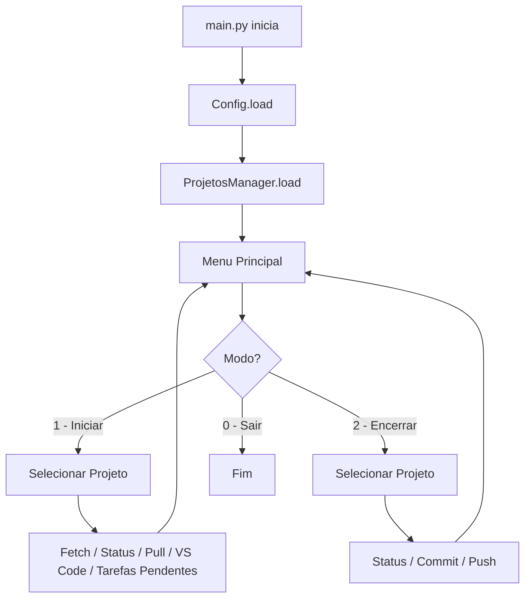
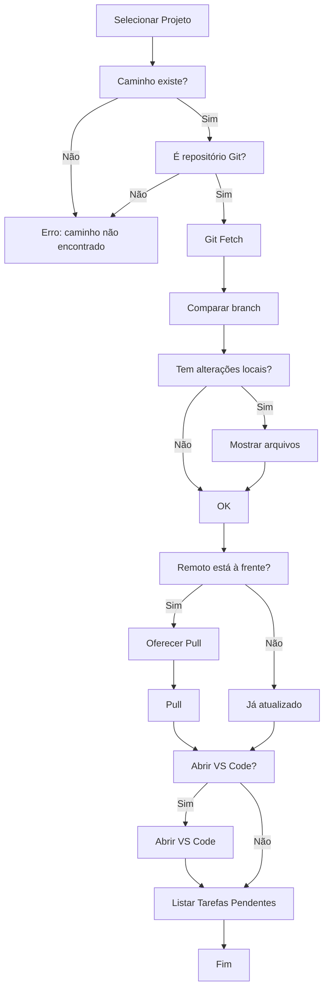
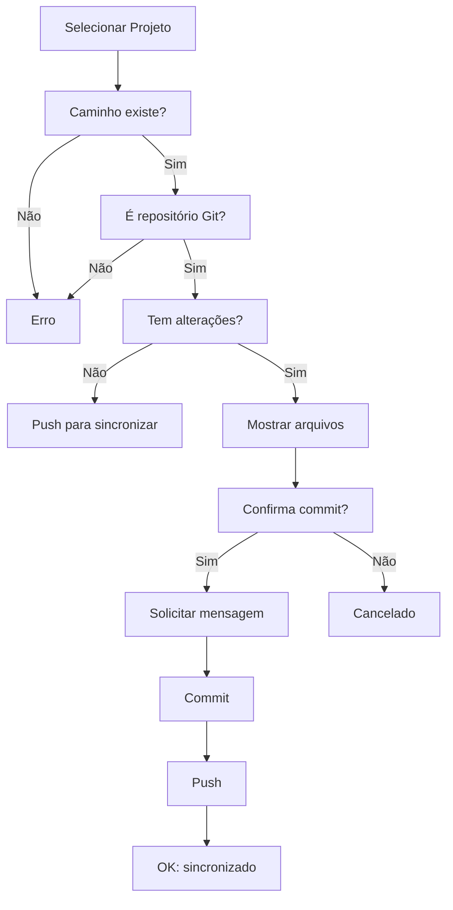

# Arquitetura do BotVSCode

## Visão Geral

O BotVSCode segue uma arquitetura modular baseada em camadas, onde cada módulo tem responsabilidade bem definida. O fluxo principal é orquestrado pelo `main.py`, que coordena a interação entre os demais módulos.

## Diagrama de Módulos

```
app/
├── main.py          # Orquestrador principal (loop do menu)
├── config.py        # Leitura e representação da configuração
├── menu.py          # Interface de menu com dois modos de operação
├── projetos.py      # Gerenciamento de projetos cadastrados
├── git_tools.py     # Operações Git (fetch, pull, commit, push, status)
├── github_tools.py  # Consulta de GitHub Issues (API REST)
├── historico.py     # Registro de histórico diário de atividades
├── vscode.py        # Abertura automática do VS Code
├── speech.py        # Síntese de voz (fase futura)
└── utils.py         # Utilitários gerais
```

## Responsabilidades

### config.py
- Dataclass `Config` com os campos: `workspace_drive`, `usuario`, `empresa`.
- Método de classe `load()` que lê o JSON em `config/config.json` e retorna uma instância tipada.

### projetos.py
- Dataclass `Projeto` com os campos: `nome`, `pasta`, `branch`, `linguagem`, `github_repo` (opcional).
- Classe `ProjetosManager` que gerencia a lista de projetos carregada de `config/projetos.json`.
- Fornece métodos para acesso indexado e contagem.

### github_tools.py
- Função `list_open_issues(repo)`: consulta a API REST do GitHub e retorna issues abertas de um repositório.
- Filtra pull requests (apenas issues reais).
- Tratamento de erros para falha de conexão.

### historico.py
- Função `registrar(tipo, descricao)`: adiciona entrada numerada no arquivo `historico_atividades_YYYY-MM-DD.txt`.
- Cria o arquivo com cabeçalho se não existir.

### menu.py
- Classe `Menu` responsável por exibir a interface textual e orquestrar os fluxos.
- Dois modos principais: **Iniciar Trabalho** (fetch → pull → VS Code → tarefas) e **Encerrar Trabalho** (status → commit → push).
- Usa `utils.saudacao()` para personalizar a saudação conforme o horário.
- Usa `utils.resolve_full_path()` para resolver o caminho completo do projeto.
- Usa `GitTools` para operações Git.
- Usa `list_open_issues()` para consultar GitHub Issues.
- Usa `registrar()` para histórico de atividades.
- Usa `open_vscode()` para abrir o VS Code.

### git_tools.py
- Classe `GitTools` que encapsula operações Git via `subprocess`.
- Métodos: `is_git_repo()`, `fetch()`, `pull()`, `push()`, `commit()`, `status_short()`, `status_full()`, `has_uncommitted_changes()`, `get_current_branch()`, `get_branch_status()` (ahead/behind).
- Tratamento de erros para Git não instalado.

### vscode.py
- Função `open_vscode(project_path)`: abre o VS Code no diretório do projeto.
- Função `is_vscode_installed()`: verifica se o comando `code` está disponível no PATH.

### utils.py
- `detect_workspace_drive()`: varre as unidades D: e E: para encontrar a pasta do projeto.
- `resolve_full_path()`: se o caminho for absoluto, retorna-o diretamente; caso contrário, combina a unidade (detectada ou fixa) com o caminho relativo.
- `saudacao()`: retorna "Bom dia!", "Boa tarde!" ou "Boa noite!" conforme o horário.

### Módulos futuros (stubs)
- `speech.py`: síntese de voz para notificações — Fase 5.

## Fluxo Principal



## Fluxo "Iniciar Trabalho"



## Fluxo "Encerrar Trabalho"



## Decisões de Arquitetura

1. **Config e Projetos em JSON**: arquivos de configuração simples, sem banco de dados, para facilitar edição manual e versionamento.
2. **Dataclasses para modelos**: representação tipada e imutável dos dados, facilitando manutenção e testes.
3. **sys.path ajustado em main.py**: permite execução direta com `python app/main.py` sem necessidade de instalação do pacote.
4. **Git via subprocess**: sem dependências de bibliotecas Git externas, usando o próprio Git instalado no sistema.
5. **Detecção automática de unidade**: suporte a ambientes onde o workspace pode estar em D: ou E: sem configuração manual.
6. **Suporte a caminhos absolutos**: `resolve_full_path()` detecta automaticamente caminhos absolutos, permitindo projetos localizados em qualquer unidade sem tratamento especial.

## Padrões Utilizados

- **Método Factory**: `Config.load()` como factory method.
- **Composição**: `Menu` recebe dependências por composição (workspace_drive, ProjetosManager).
- **Dataclass**: modelos de dados com tipagem e sem boilerplate.
- **Façade**: `GitTools` como fachada para comandos Git.

## Extensibilidade

Para adicionar uma nova funcionalidade:

1. Implementar o módulo correspondente.
2. Injetar a dependência em `Menu` ou em `main.py`.
3. Adicionar a opção no menu.
4. Chamar o método apropriado.

O baixo acoplamento entre módulos permite que cada fase seja implementada de forma incremental.
